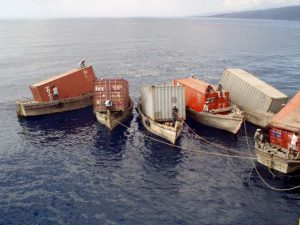

> [copied from here](
https://eldermoraes.com/java-containers-what-i-wish-i-knew-before-i-used-it/) 

When I first heard about containers, the picture that I had in my mind was something like this:

Everything:

- Organized
- Orchestrated
- Just working
- Beautiful

But the first time that I really tried to do something meaningful with it, the real picture was something like this:

Everything:

- Not very well organized
- Not very well orchestrated
- Not really working
- Could be *so much* better