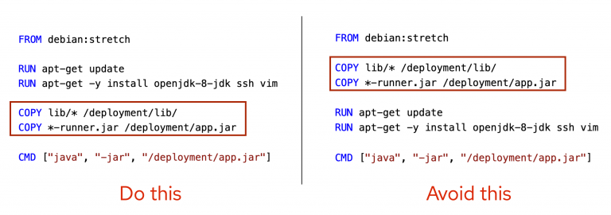
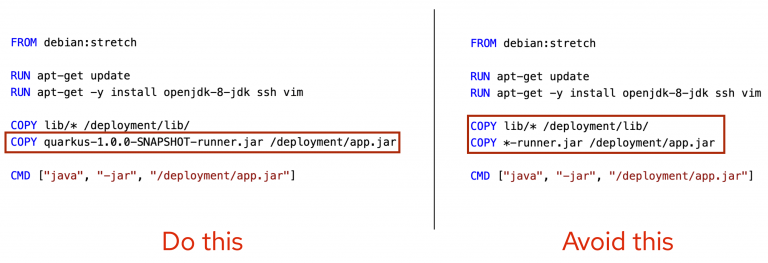
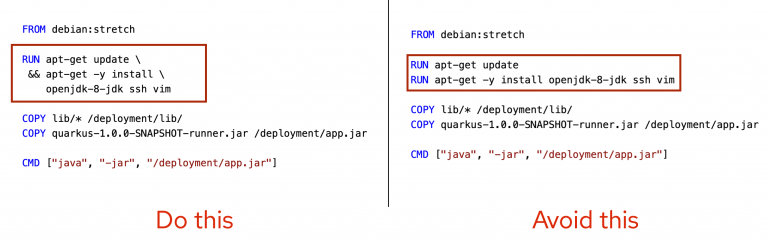
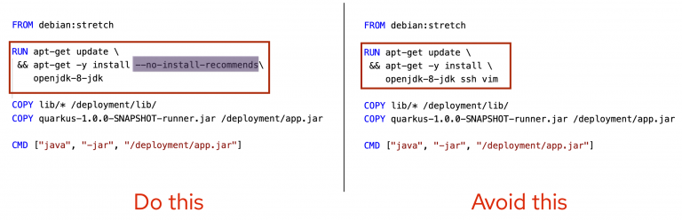
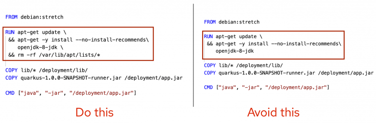
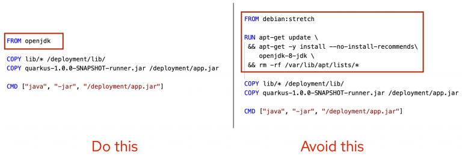
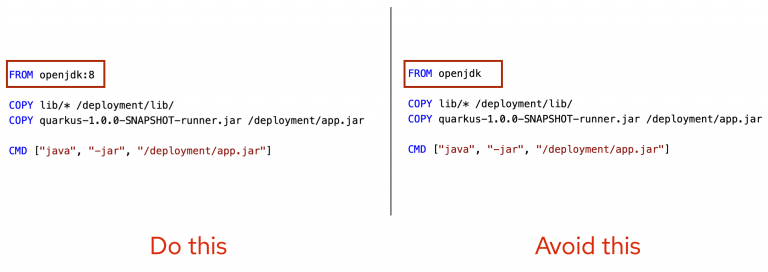
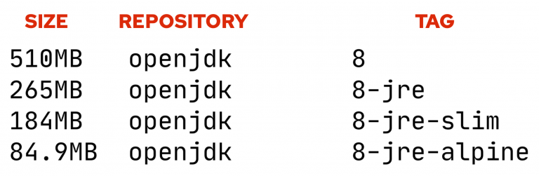
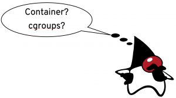
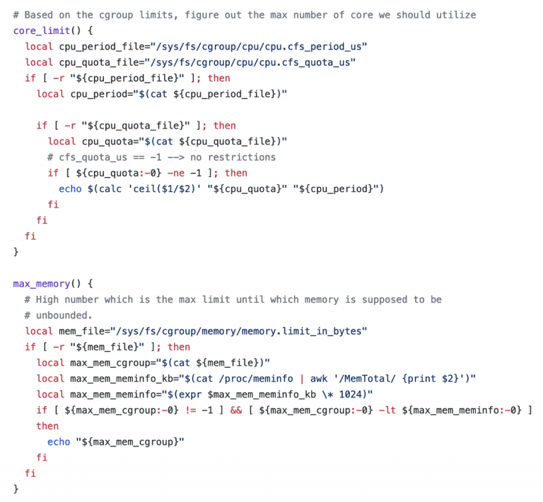

[Excelent article on Java in contaoineres](https://eldermoraes.com/java-containers-what-i-wish-i-knew-before-i-used-it/) .. almost copied in here. 

---

- [How to try and use Java in containers and stay sane](#how-to-try-and-use-java-in-containers-and-stay-sane)
- [Long build time of JDK containers](#long-build-time-of-jdk-containers)
  - [JDK in a Dockerfile : Mind the order of the caching](#jdk-in-a-dockerfile--mind-the-order-of-the-caching)
  - [JDK in a Dockerfile : Be specific when caching](#jdk-in-a-dockerfile--be-specific-when-caching)
  - [JDK in a Dockerfile : Group units for caching](#jdk-in-a-dockerfile--group-units-for-caching)
- [How to get rid of huge image size](#how-to-get-rid-of-huge-image-size)
  - [JDK in a Dockerfile : Mind unnecessary dependencies](#jdk-in-a-dockerfile--mind-unnecessary-dependencies)
  - [JDK in a Dockerfile : Eliminate package manager cache](#jdk-in-a-dockerfile--eliminate-package-manager-cache)
  - [JDK in a Dockerfile : Use optimized tools and frameworks](#jdk-in-a-dockerfile--use-optimized-tools-and-frameworks)
- [How to stay away from hard maintainability](#how-to-stay-away-from-hard-maintainability)
  - [JDK in a Dockerfile : Use official images](#jdk-in-a-dockerfile--use-official-images)
  - [JDK in a Dockerfile : Be specific with tags](#jdk-in-a-dockerfile--be-specific-with-tags)
  - [JDK in a Dockerfile : Choose minimal size images](#jdk-in-a-dockerfile--choose-minimal-size-images)
- [Java: How to manage resources allocation](#java-how-to-manage-resources-allocation)
  - [Java 8u121 and before](#java-8u121-and-before)
  - [Java 8u131 and Java 9](#java-8u131-and-java-9)
  - [Java 8u191 and Java 10](#java-8u191-and-java-10)
  - [Java 11](#java-11)
  - [Java 12 and 13](#java-12-and-13)
  - [Java 14](#java-14)
- [Wrapping up](#wrapping-up)
- [References](#references)

# How to try and use Java in containers and stay sane

# Long build time of JDK containers

If you ever tried even to run a “hello world” using Java containers, you noticed that the build time for image creation is something to consider. If this is true for a “hello world”, imagine for a huge and Java complex application.

Your life savior to tackle this is caching. And here are 3 simple strategies that will help you… a lot!

##  JDK in a Dockerfile : Mind the order of the caching

The golden rule here is:

> What rarely changes, go first. What changes at most, go last.

This happens because your container engine will create a cache for each command that is running inside your Dockerfile.

Then, when you build a new version of your Java JDK application and try to build a container image based on it, then the cache for that line equivalent to your application will need to be recreated.

And whatever is after that will also lose its cache.

## JDK in a Dockerfile : Be specific when caching

If you just say “copy whatever that is in the folder to the container”, guess what? It can be changed for whatever reason and… it will break the cache.

> Do not copy folders, copy files.

It will decrease a lot the chance of breaking the cache for no reason (example: someone copied a file to that folder accidentally).

## JDK in a Dockerfile : Group units for caching

If the container engine will create a cache for each line of command in your Dockerfile… what would happen if you group lines (when possible)?

Yes, you answered correctly: it -will help the cache management of your container image.

> Whenever is possible, group commands/lines that can be grouped

# How to get rid of huge image size

To reduce JDK based image sizes you need to reduce what is going inside of it. Looks obvious, but the 3 strategies that I’ll show you right now will prove the opposite.

## JDK in a Dockerfile : Mind unnecessary dependencies

In the example above we are doing two things:

- Removing “ssh” and “vim” from the container. Why will you need them inside a container? If it’s for debugging times, you can always install them when needed
- Using `–no-install-recommends` flag. This is an option for the APT manager that will prevent from automatically installing recommended packages. It can save a **lot** of storage space.

> If you don’t need it, don’t install it in your container.
>

## JDK in a Dockerfile : Eliminate package manager cache

Your laptop needs the package manager’s cache. Your server needs. Your PC needs. Your container doesn’t.

> Remove from your container any cache that is not related to it.

## JDK in a Dockerfile : Use optimized tools and frameworks
If you are using something that will make your application big by default, guess what? It will make your container image bigger. There’s no free lunch…

I have two recommendations on this matter:

- Build your Java applications using **Quarkus**. It will make your package smaller. By far;
- Depending on your use case, you can consider using native-images create with Graal VM. It will package only the dependencies that are needed in a self-executable file.
> Do not use something that will make your application bigger for no reason.
>
# How to stay away from hard maintainability

When you create a Dockerfile for your JDK container image, there’s no difference from whatever code you create: you’ll need to maintain it.

So, for the same reasons, if there’s some way to ease it… why not take it?

## JDK in a Dockerfile : Use official images

What if you can base your image in a pre-built image that was built following these and many other best practices?

Well, you can. Most of the biggest projects that publish container images for broad usage are following the best practices for containers.

I cannot say for whatever technology, but I can say it for sure, for example, for OpenJDK.

> So instead of building a great container image for Java, build yours based on the OpenJDK public images.
>
## JDK in a Dockerfile : Be specific with tags

When you don’t use some tag specifically, you are using the “latest”. And what’s the problem with it?

Well… whenever the latest is updated, your image will also be updated. It can be harmless, it can change the application’s behavior, or it can even break the application.

And, come on, this should be the same approach that you use with your applications in general, right?

> Don’t ever, ever, use the latest tag. Be specific.

## JDK in a Dockerfile : Choose minimal size images

> to be updated for [the latest JDK](https://www.codejava.net/java-se/java-se-versions-history)

Check this comparative jor JDK8 ([the latest LTS is 17](https://www.codejava.net/java-se/java-se-versions-history)):

So, in the previous example, if you just use the “8” tag, your container is starting with 510 MB of size. Without your application!

The proper approach should be to start with “8-jre-alpine” and, in case you need something there is available only in the “…-slim”, there you go. Pick it.

> Always start with the smallest base image as possible.

# Java: How to manage resources allocation
> By far, the biggest issues I ever faced when using Java with containers were related to resource allocation. Mainly memory and CPU.

But luckily this is something that has been tackled release after release, and it’s worthy to cover this path here (hope I’m able to cover the version you are using).

Containers, in the way that we use them today, have originated from something called cgroup. Accordingly to an article of the Linux Jornal (URL at the end of this post):

> Control groups (cgroups) is a kernel feature that limits, accounts for and isolates the CPU, memory, disk I/O and network’s usage of one or more processes.

Alright, so what’s the matter?

The matter is that when Docker containers came to the IT industry, Java was already 10 years old or so, and the JVM just wasn’t aware of this thing called cgroup.

So the JVM, in the scenario, just go ahead and allocate memory looking to the host resources, not the container resources. Now you do the math!

Now let’s follow the Java history related to containers and how to deal with resource allocation.

## Java 8u121 and before
If you are using Java 8u121 and before, I would say: don’t use it with containers.

Ok, maybe you just have to… so I would say: use this “hack” created by the Fabric8 folks:

This is a small part of the script that will help your JVM recognize the container resources, not the host resources. The URL for the full project is at the end of this post

## Java 8u131 and Java 9
Some flags were introduced to the platform:

- ParallelGCThreads: helps to limit the cpu usage of a container
- UseCGroupMemoryLimitForHeap: JVM uses the cgroups limits to calculate memory defaults
- MaxRAMFraction: percentage of available RAM that can be used

## Java 8u191 and Java 10

Those previous flags were deprecated and these new flags were introduced:

- InitialRAMPercentage: initial percentage of heap allocation
- MaxRAMPercentage: maximum percentage of heap allocation
- MinRAMPercentage: minimum percentage of heap allocation
And with the JDK-8196595 the number of CPUs is calculated from container allocation by default.

## Java 11
I would say: if you are fresh starting with Java and containers, start with Java 11.

Some improvements in this version:

- XshowSettings (Container Metrics): display the system or container configuration
- JDK-8197867: improve CPU calculations for both containers and JVM hotspot (see PreferContainerQuotaForCPUCount)

## Java 12 and 13
- jhsdb now can be attached to Java processes running in containers (JDK-8205992)
- Container support improved for Java Flight Recorder (JDK-8203359)
- Improve systemd slice memory limit support (JDK-8217338)

## Java 14
- JFR Event Streaming: expose JDK Flight Recorder data for continuous monitoring (easier for observability in clusters)
- Packaging Tool: tool for packaging self-contained Java applications (incubator)

# Wrapping up
Straight to the point:

- Yes, Java and containers *might* get along!
  -  be very carefull
- Be intentional when building your Dockerfiles for JDK
  - be vigilant
- Better start with Java JDK 17 
  - the most recent Long Term Support (LTS) release
- If you *really* need Java in a containers (why?), be extra cautious

# References
- https://www.docker.com/blog/intro-guide-to-dockerfile-best-practices/
- https://www.linuxjournal.com/content/everything-you-need-know-about-linux-containers-part-i-linux-control-groups-and-process
- https://quarkus.io/
- https://www.graalvm.org/
