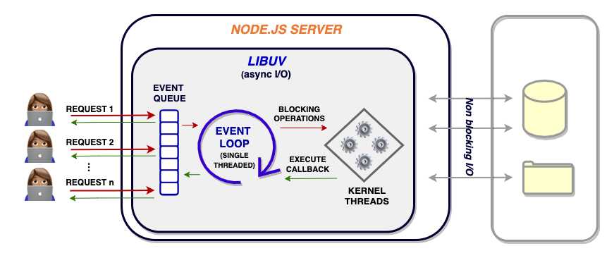
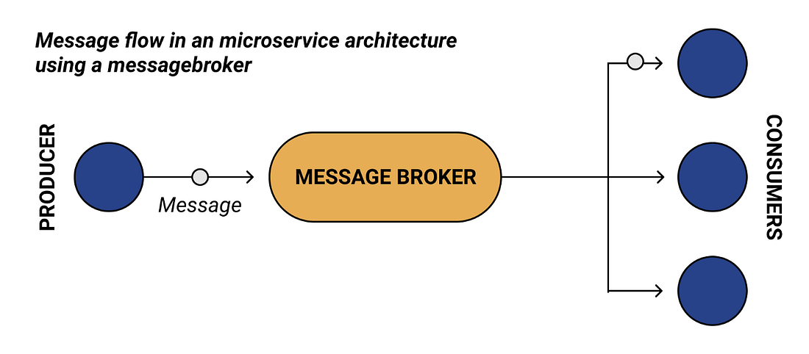
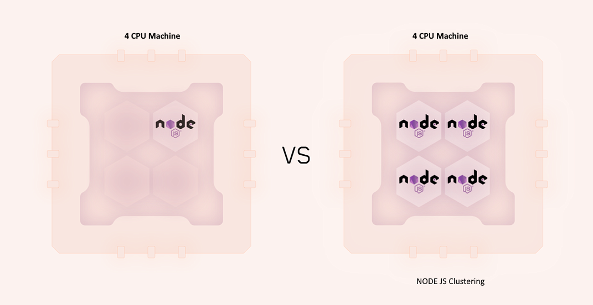
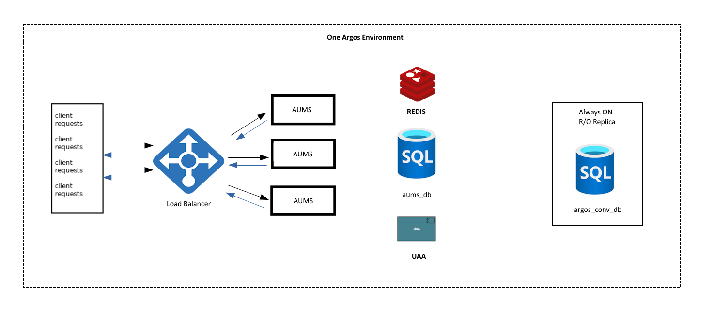

# Is NODE JS a good choice for micro services development ?

(hint: it is)

<!-- https://dev.to/chegerose/top-5-cloud-native-message-queues-mqs-with-nodejs-support-ak5
 -->

 ## The core of the core

[Node.js](https://nodejs.org/en/docs) is a popular technology that offers a [wide range of features for your application](https://medium.com/@chegerose84/5-enhancements-that-will-boost-your-node-js-app-ca0c57ab191d). This include:

- Asynchronous/Non-blocking thread execution. Node.js allows you to create Non-blocking servers/API. Every Node.js API is non-blocking. The subsequent tasks in the stack are continuously run while waiting for a response for something outside of the execution chain. Its single-threaded asynchronous capabilities make it well-suited to real-time communication processes. This is the exact architecture that you would desire to build your servers with. The fact that message queues are Asynchronous, your application performs at full potential.
- Event-driven. A node.js server is Event-driven. It uses Event Loop to handle multiple clients simultaneously. It uses its multiple threads pool for concurrent executions. 
  - This way, each time a request is sent, a dedicated thread is created to handle that specific request. This, again, makes it easier for non-blocking executions.

The architecture of every node js app.
> &nbsp;
> 
> **Node.js offers native scalability to build microservices applications**
> &nbsp;

# 5 enhancements that will boost every Node.js app

[The source](https://medium.com/@chegerose84/5-enhancements-that-will-boost-your-node-js-app-ca0c57ab191d)
## An overview

> 
> &nbsp;
>
> Node.js is an open-source cross-platform runtime environment. It is used for running server-side applications. Node.js is used to build applications of all levels that require a data-intensive model.
> 
> &nbsp;
>

Node.js is (blazingly) light and fast, allowing developers to create high-performant applications. It is built on a high-performance (Google) [V8 engine](https://v8.dev/) to compile and executes the JavaScript code.

Any developer,can exclusively exploit the Node.js capacity to build highly scalable CLoud hostd applications. 

Nevertheless, the same developer will need different tools to ensure Node.js applications run even faster. 

Let’s discuss tips and tools developers can use to optimize and boost the already fast architecture that Node.js delivers.

# Advanced NODE JS Cloud Hosting App Architectures

## A message broker
A message broker is a software that provides stable, reliable communication between two or more applications/subsets of an application. Basically, a message broker runs an architecture technique that allows you to break applications apart while still ensuring asynchronous communication.

In this case, a message is the piece of information that you want to get processed from one application to another. A broker acts as a medium where actual data payloads are transmitted between the applications. A message broker uses a queue system to hold. It manages queues with the order they are received and delivers them to the actual party.

Here is a general architecture of how a message broker works:

Now that we have an idea of what a message broker is. How does it enhance the scalability of an application? To answer this question, let’s learn the higher-level advantages that a message broker offers:

- **Simplified Decoupling** — A message broker eliminates the dependencies between applications. A message broker act as the middleman between a client and the server. It’s the work of the server to send data to a broker. A server doesn’t have to be in direct contact with its message recipient. When the client needs the data, it just gets the messages from the broker at any time. It is not essential to use a discovery methodology to identify the location of server instances. The message broker takes care of these situations.
- **Increased Architectural Reliability** — The server can send messages whether or not the client is active and vice versa. The only component that must be running is a message broker. When a server sends messages, its job is done. It is now the work of the broker to deliver the messages to the appropriate recipients.
- **Asynchronous Processing** — Assume you are running a Node.js full-scale API using the REST architecture. The server and client are tightly coupled together to make requests and responses and exchange data. The two communicate directly using designated endpoints based on the HTTP protocol. What happens here is if the client sends a request, it expects an immediate response from the server. A REST communication is synchronously designed. It works with pre-defined requests that must return a response. If the response fails, undesirable user experiences can happen, such as a timeout error. On the other side, message brokers are Asynchronous. No one has to wait. Timeout errors can never occur in such architectures.

### How does this benefit Node.js apps?

- **Improved system performance** — Message brokers use message queues for asynchronous communication. High-demand processes can be isolated into independent processes. This ensures data transfer is optimized as no system component is ever held up while waiting for the other. That will help accelerate your application performance and enhance the user experience.
- **Scalability** — The server and the client can all expand and contract in response to data demands. Components can keep adding entries to the queue even when demand peaks without fearing the system crash. Likewise, clients can be scaled up and workload distributed based on incoming data.

Great examples of message brokers can be found in [this repo,](https://github.com/aliyr/Nodejs-Developer-Roadmap) 

A new one I recently found is [Memphis](https://memphis.dev/). It’s a great fit for node.js.

## Build Node.js App with gRPC
[gRPC ](https://grpc.io/)is an open-source remote procedure call (RPC) framework used to build scalable fast communication microservices. 

It helps create a high-performant communication protocol between micro services. An RPC framework uses a client to directly invoke a function on the server. 

In simple terms, RPC is a protocol that allows a program to execute a procedure of another program located on another computer without explicitly coding the details of the network interaction. It’s automatically handled by the underlying framework.

What makes the gRPC framework special?

- It uses the *HTTP/2 protocol.* Architectures such as REST use the traditional HTPP 1.1 as the transfer protocol. This protocol is based on a request-response model using generic HTTP methods, such as GET, POST, PUT, and DELETE. If many clients submit requests, they are each accepted one at a time. HTTP/2 protocol supports a bidirectional communication model alongside the request-response model. It is possible to serve multiple requests and responses simultaneously. This creates a loose coupling between server and client, allowing you to build fast and efficient applications that support streaming with low latency.
  
- It uses Protocol buffers (**protobuf**) as the message format. When exchanging data using a SOAP protocol, the exchange of information happens over XML. When using REST, the data are exchanged using JSON format. In gRPC, data is exchanged over protocol buffers. 
  - Protocol buffers are lightweight, faster, and efficient as compared to both XML and JSON. It has fewer payloads. Under the hood, it performs serialization of the structured data. The protobuf compiler turns the data structure into the protobuf binary format, which is used to describe the communication format between the client and the server.
  
- **Language agnostic** — The majority of modern languages and frameworks largely support gRPC, such as Node.js, Python, Go Java, PHP, and C#. A client and the server can be built with different languages/frameworks. It is more flexible than conventional APIs since clients can use any function, not only the typical GET, POST, and DELETE methods.
  
How does running Node.js with gRPC benefit your application:

- Faster communication — gRPC uses HTTP/2. This minimizes latency and network bandwidth usage to ensure a smoother user experience. At the same time, it is API-driven, which provides you flexibility in interface design.
  
- Increased application performance — REST uses synchronous calls. This ensures that the server has returned a response before execution continues. However, gRPC Asynchronous queries return instantaneously, and the response is processed as an independent task.
  
- Lightweight messages — Protocol buffers are considered smaller compared to JSON messages with a [difference of up to 30 percent](https://auth0.com/blog/beating-json-performance-with-protobuf/).
  
gRPC and Message Brokers help you handle and manage your application messages. [Check how gRPC compares to Message Broker](https://memphis.dev/blog/grpc-vs-message-broker/).

## Optimizing Node.js with clustering

Node.js is single-threaded. It uses only one CPU to execute an application by default. This means if you have 8 CPUs on your machine, [Node.js threads](https://nodejs.org/docs/latest-v17.x/api/worker_threads.html) are spawned to only utilize one CPU even when performing CPU-intensive operations. This hinders the application from utilizing the full power the underlying bare metals have which can lead to a server deadlock situation.

To solve this, Node.js uses clusters. A cluster is a group of node instances running on a computer. In this case, Node.js uses the main CPU as its master instance and other available CPUs as the worker instances.

[Node.js clustering](https://nodejs.org/api/cluster.html#how-it-works) allows networked Node.js applications to be scaled across the number of available CPUs. Here is a basic example of node clustering.

That computer has 4 processors. By default, Node.js single-threaded nature will only utilize on the CPU. However, we can spawn tasks across the available CPUs using the [Node.js cluster module](https://nodejs.org/api/cluster.html) under the hood. 

Node.js can run the child process and share the server ports while still being able to communicate with the parent Node process. Depending on the number of CPUs provided, it significantly boosts the performance, efficiency, and reliability of your application.

> This is intrusive method. It requires code change.

# Load balancing

Load balancing is a process of distributing application tasks within a given set of resources to ensure efficient usability of overall resources. This way, all your client requests get evenly and equally distributed to the backend nodes managing your application.

It is essential to have a load balancer configured to your Node.js in order to scale your deployment based on the resources demand. 

# Other practices to power up Node.js app

There are many practices that one can use and ensure Node.js scales the application. Other practices and tools include:

- Practicing [asynchronous executions](https://nodejs.org/en/docs/guides/blocking-vs-non-blocking/).
- [Logging](https://www.twilio.com/blog/guide-node-js-logging) and [monitoring](https://blog.risingstack.com/monitoring-nodejs-applications-nodejs-at-scale/) the application performance.
- Writing light and compact code 
- Practicing [memory optimization](https://redis.io/docs/reference/optimization/memory-optimization/)
- Enhancing data handling techniques, for example, [GraphQL vs. REST designs](https://hasura.io/learn/graphql/intro-graphql/graphql-vs-rest/).
- Use the [Node.js Deflate and Gzip compression middleware](https://github.com/expressjs/compression) to compress server requests and responses.